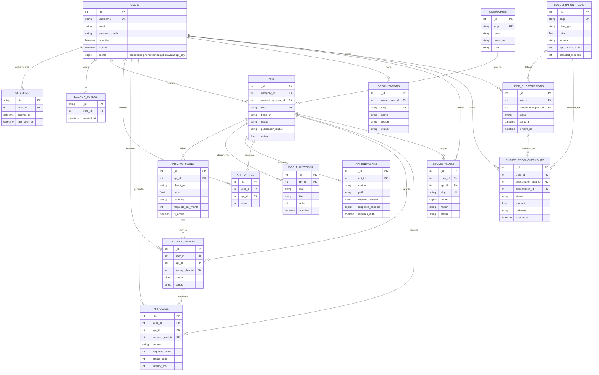

# IranAPI MongoDB Logical Data Model

Runtime portal data is stored through `MongoRepository`. MongoDB does not
enforce foreign keys; arrows below represent application-level ID references.
`users.profile` is embedded inside each user document.

## Collection groups

- Identity: `users`, `sessions`, `legacy_tokens`.
- Catalog: `categories`, `apis`, `pricing_plans`, `documentations`,
  `api_endpoints`, `api_ratings`.
- Access and telemetry: `access_grants`, `api_usage`.
- Workspace: `organizations`, `studio_flows`.
- Portal billing: `subscription_plans`, `user_subscriptions`,
  `subscription_checkouts`.

## Important distinctions

- API-specific `pricing_plans` define access to one API.
- Portal-wide `subscription_plans` define IranAPI account limits and billing.
- `subscription_checkouts` use `gateway: "manual"` in current implementation.
- `api_usage` stores aggregate or event-like usage records from sources such as
  Caller, Studio, and imported marketplace synchronization.
- Django ORM models and migrations remain in repository for legacy/admin
  compatibility, but `/api/v1/` reads and writes through `MongoRepository`.

PlantUML version: [`database-diagram.puml`](database-diagram.puml)
