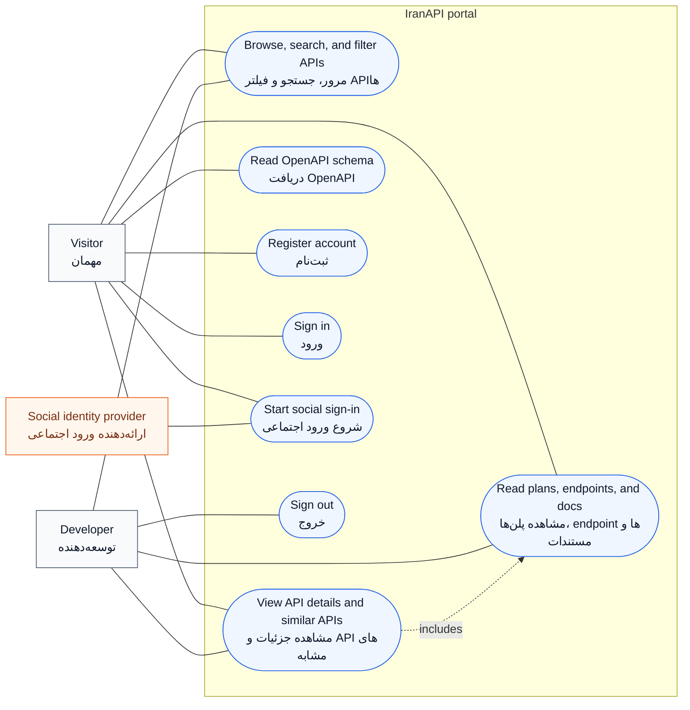
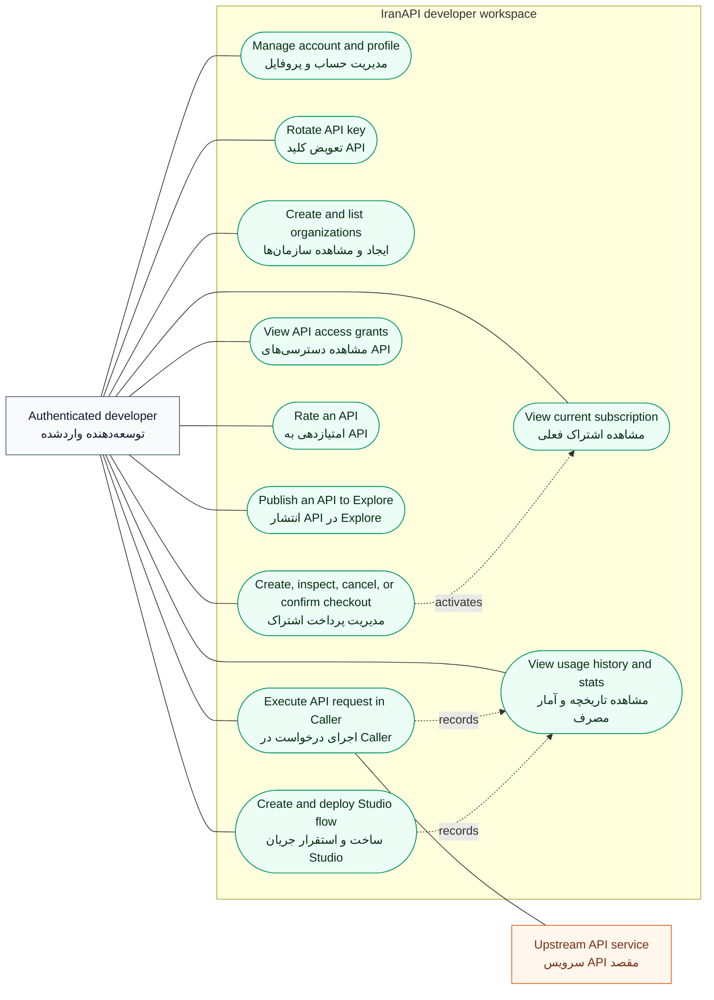
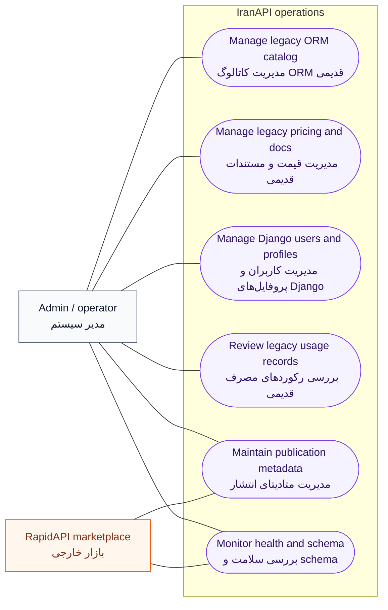

# IranAPI Project Use-Case Diagrams

These diagrams describe implemented behavior exposed by the canonical `/api/v1/`
API and current React portal.

## 1. Public discovery and identity

## 2. Developer workspace and billing

## 3. Operations and external boundaries

## Actors and boundaries

- `Visitor`: anonymous catalog and documentation reader.
- `Authenticated developer`: portal user with account, publishing, billing,
  caller, Studio, access, and usage features.
- `Admin / operator`: manages legacy Django ORM/admin records and monitors
  operational endpoints. Mongo catalog administration has no dedicated admin UI.
- `Social identity provider`: configured external authentication redirect target.
- `Upstream API service`: destination called by authenticated Caller requests.
- `RapidAPI marketplace`: external publication-metadata boundary. Live webhook
  ingestion and externally driven quota enforcement are not implemented.

## Editable UML source

PlantUML version: [`use-case-diagram.puml`](use-case-diagram.puml)

Database diagram: [`database-diagram.md`](database-diagram.md)
